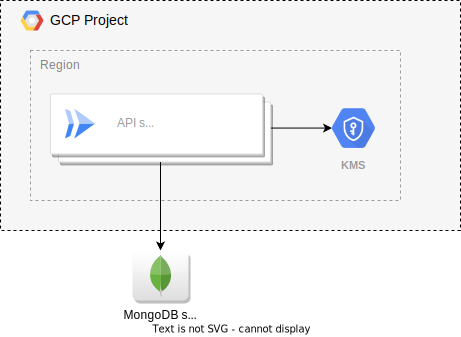

# Terraform module `relaycorp/veraid-authority/google`

This is a Terraform module to manage an instance of [VeraId Authority](https://docs.relaycorp.tech/veraid-authority/) on Google Cloud Platform (GCP) using serverless services.

The module is responsible for all the resources needed to run the endpoint app on GCP, except for the following (which you can deploy to any cloud and any region):

- The MongoDB server.
- The DNS records.
- The [Awala Internet Endpoint](https://registry.terraform.io/modules/relaycorp/awala-endpoint/google/latest), if you're using the [Awala integration](https://docs.relaycorp.tech/veraid-authority/awala).

The [following diagram](https://github.com/relaycorp/terraform-google-veraid-authority/blob/main/diagrams/diagram-without-awala.svg) illustrates the cloud architecture created by this module:

